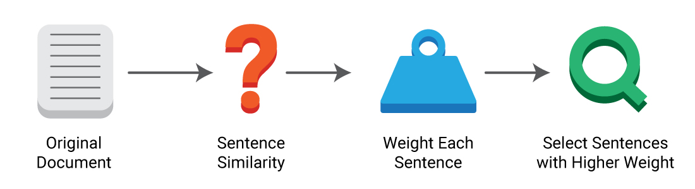
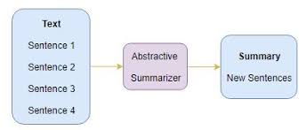
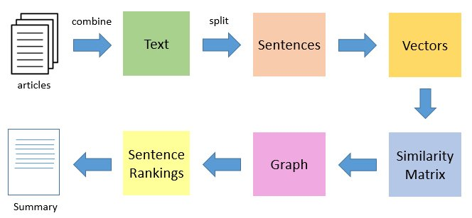
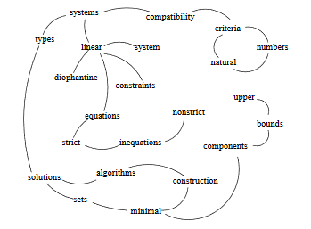

# Text summarization 

## Motivation of Project
* A lot of real world applications on daily produce text data like articles, 
  news, sport commentary, movie subtitles, scientific research etc. Summarization 
  involves extracting the key summary from the big text document.
* Task of generating intelligent and accurate summaries for long  text is very
  popular area of research in Natural Language Processing 

               

## Text summarization methods
* Mainly there are two methods for text summarization as given below
    + Extractive Text summarization 
        + In this method the sentences in the text document are given some
          weight depending upon how much importance they hold in the document.
          The resulting summary consists of all the inorder sentences which have 
          got the highest weight.
          
    + Abstractive Text summarization
        + In this method new shorter sentences are generated by interpreting the 
          semantics of the context. It can be correlated to the way human reads 
          a text article or blog post and then summarizes in their own word.
          

## Implementation of Extractive text summarization Algorithms

* The project is based on doing extractive text summarization on text document
  using the algorithm named **TextRank**. It is unsupervised learning algorithm
  which ranks the sentences based on similarity for summarization.

### TextRank Algorithm 

* **TextRank** is graph based algorithm for Natural Langauge processing that can be
  used for keyword and sentence extraction. Algorithm works on similar line of 
  **Pagerank algorithm** used by google for displaying web pages.

 

* **Text Clening** : First tokenize all the text into sentences in the document 
  and then  remove all the stop works and lemantize all the words present in 
  the tokenized sentence.

* **Sentence Vectorization** : Inorder to run textrank algorithm we first 
  convert the sentence format into numbers, without lossing any of the 
  information. For this we vectorize now each sentences into unique vector
  which represents the information stored in the sentence.
    + By this method we tokenize and normalize the text into individual words
      and create a vector words count.
    + First create term document matrix which is normalized according to TF-IDF 
      which reflects how much important the words in the vectorized sentence.
      Depending upon the importance we normailze the word into 0 or 1.

 

* **Graph of sentences** : Generate graph where each node is sentence and edge
  between the sentence defines the similarity in between the sentences. The
  similiary in between the two sentences is basically the number of common
  words they have so simiply take the dot product of the two sentences.

* **Apply Page Rank Algorithm** :

